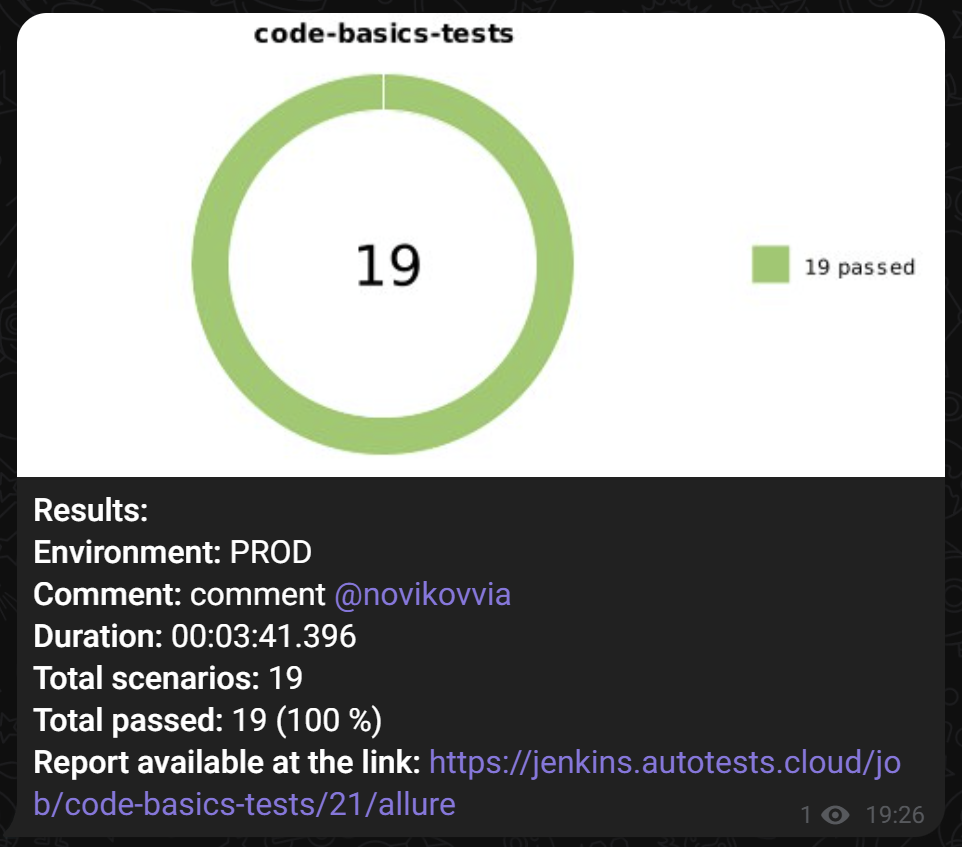

# Проект по автоматизации тестирования для веб-приложения [CODE BASICS](https://code-basics.com/ru)

> **CODE BASICS** — Это полностью бесплатная платформа для изучения основ программирования с нуля. Code Basics был создан разработчиками и сообществом Хекслет для того, чтобы любой желающий мог попробовать себя в программировании и заложить правильный фундамент для новой профессии, основанный не на запоминании специфики, а на понимании системы в целом.

## **Содержание:**
____

* <a href="#tools">Технологии и инструменты</a>

* <a href="#cases">Примеры автоматизированных тест-кейсов</a>

* <a href="#jenkins">Сборка в Jenkins</a>

* <a href="#console">Запуск из терминала</a>

* <a href="#allure">Allure отчет</a>

* <a href="#alluretestops">Интеграция с Allure TestOps</a>

* <a href="#telegram">Уведомление в Telegram при помощи бота</a>

____
<a id="tools"></a>
## <a name="Технологии и инструменты">**Технологии и инструменты:**</a>

<p align="center">  
<a href="https://www.jetbrains.com/idea/"></a>  
<a href="https://www.java.com/"></a>  
<a href="https://github.com/"></a>  
<a href="https://junit.org/junit5/"></a>  
<a href="https://gradle.org/"></a>  
<a href="https://selenide.org/"></a>  
<a href="https://aerokube.com/selenoid/"></a>  
<a href="ht[images](images)tps://github.com/allure-framework/allure2"></a> 
<a href="https://qameta.io/"></a>   
<a href="https://www.jenkins.io/"></a>  
</p>

____
<a id="cases"></a>
## <a name="Примеры автоматизированных тест-кейсов">**Примеры автоматизированных тест-кейсов:**</a>
____
- ✓ *Успешная авторизация с валидными данными.*
- ✓ *Авторизация с неверным паролем.*
- ✓ *Переход на страницу восстановления пароля.*
- ✓ *Успешное восстановление пароля с валидным email.*
- ✓ *Восстановление пароля с невалидным email.*
- ✓ *Восстановление пароля с несуществующим email.*
- ✓ *Восстановление пароля с пустым полем email.*
- ✓ *Проверка успешной смены языка.*
- ✓ *Проверка открытия тренажера с курсами по Java.*


____
<a id="jenkins"></a>
## </a><a name="Сборка"></a>Сборка в [Jenkins](https://jenkins.autotests.cloud/job/code-basics-tests/)</a>
____
<p align="center">  
<a href="https://jenkins.autotests.cloud/job/code-basics-tests/"></a>  
</p>


### **Параметры сборки в Jenkins:**
 
- *ENVIRONMENT (окружение в котором будем запускать тесты, по умолчанию PROD)*
- *COMMENT (комментарий, который отобразиться в Telegram отчете)*
- *BROWSER (браузер, по умолчанию chrome)*
- *REMOTE_URL (адрес хоста для удалённого запуска тестов)*
- *BROWSER_VERSION (версия браузера)*
- *BROWSER_SIZE (размер окна браузера)*

<a id="console"></a>
## Команды для запуска из терминала
___
***Локальный запуск:***
```bash  
gradle clean uiTests
```
```bash  
gradle clean test
```

***Удалённый запуск через Jenkins:***
```bash  
clean 
uiTests 
"-DbrowserType=${BROWSER}" 
"-DbrowserSize=${BROWSER_SIZE}" 
"-DremoteUrl=${REMOTE_URL}"
"-Dlogin=${LOGIN}"
"-Dpassword=${PASSWORD}"
```
___
<a id="allure"></a>
## </a> <a name="Allure"></a>Allure [отчет](https://jenkins.autotests.cloud/job/code-basics-tests/allure/)</a>
___

### *Основная страница отчёта*

<p align="center">  
  
</p>  

### *Тест-кейсы*

<p align="center">  
  
</p>

### *Графики*

  <p align="center">  


</p>

### Интеграция с [Allure TestOps](https://allure.autotests.cloud/project/4707/test-cases?treeId=0)

<p align="center">
  
</p>

____
<a id="telegram"></a>
## </a> Уведомление в Telegram при помощи бота
____
<p align="center">  
  
</p>

____
